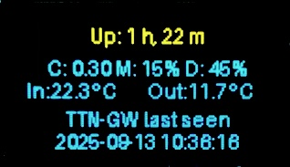

# Raspberry Pi Status Monitor

A comprehensive system for monitoring and displaying sensor data on a Raspberry Pi, featuring temperature, humidity, and pressure sensors with OLED display support.

## Features

- Support for multiple sensor types:
  - DS18B20 (1-Wire temperature sensors)
  - HTU21/Si7021 (I²C temperature and humidity)
  - BME280 (I²C temperature, humidity, and pressure)
- I²C multiplexer support (TCA9548A)
- OLED display for real-time data visualization
- MQTT integration for data publishing
- Systemd service integration
- Automatic sensor detection and configuration

## Prerequisites

### Hardware Requirements
- Raspberry Pi (tested on Raspberry Pi OS Bookworm)
- Compatible sensors (DS18B20, HTU21, Si7021, or BME280)
- SSD1306 OLED display (optional)
- TCA9548A I²C multiplexer (optional)

### System Configuration
```bash
# Enable I²C and 1-Wire interfaces
sudo raspi-config
# Choose: Interface Options -> I2C -> Yes
# Choose: Interface Options -> 1-Wire -> Yes
```

## Installation

The installation script will automatically install all required system packages and Python dependencies.

1. Clone and enter the repository:
```bash
git clone https://github.com/thomo/raspi-status.git
cd raspi-status
```

> **Note:** All commands in this documentation assume you are in the `raspi-status` directory.

2. Run the installation script:
```bash
sudo ./install.sh
```

The installer will:
- Ask for installation location
- Ask for user/group to run services as
- Set up a Python virtual environment
- Install required Python packages
- Install and configure systemd services

## Configuration

### Automatic Sensor Detection

Generate a configuration file with all connected sensors:
```bash
./fetchsensors.py --generate
```

This will:
- Detect all connected I²C and 1-Wire sensors
- Create a `sensors.json` file with detected sensors
- Include multiplexer channel information if applicable

### Manual Configuration

Edit `sensors.json` to customize:
- Sensor locations
- Measurement corrections
- MQTT settings
- Update intervals

Example configuration:
```json
{
    "mqtt": {
        "server": "mqtt.server.any",
        "topic": "sensors/data"
    },
    "interval": 20,
    "node": "raspberrypi",
    "sensors": [
        {
            "id": "28-0301a279dec6",
            "sensor": "DS18B20",
            "enabled": 1,
            "location": "outside",
            "values": [
                {"correction": -1.1, "measurand": "temperature"}
            ]
        },
        {
            "id": 64,
            "channel": 2,
            "sensor": "HTU21",
            "enabled": 1,
            "location": "living_room",
            "values": [
                {"correction": -0.5, "measurand": "temperature"},
                {"correction": 2.0, "measurand": "humidity"}
            ]
        }
    ]
}
```

## Usage

### Sensor Data Collection (fetchsensors.py)

```bash
# activate venv first
source ./venv/bin/activate

# Normal operation
./fetchsensors.py

# Use custom config file
./fetchsensors.py -c /path/to/sensors.json

# Test run without publishing to MQTT
./fetchsensors.py --dry

# Generate sensors.json with detected sensors
./fetchsensors.py --generate
```

### OLED Display (updateoled.py)

The OLED display shows:
- System uptime
- CPU, memory, and disk usage
- Indoor and outdoor temperatures
- TTN Gateway status



## Service Management

Both components can run as systemd services:

```bash
# Start services
sudo systemctl start fetchsensors.service
sudo systemctl start updateoled.service

# Enable services to start at boot
sudo systemctl enable fetchsensors.service
sudo systemctl enable updateoled.service

# Check service status
sudo systemctl status fetchsensors.service
sudo systemctl status updateoled.service

# View logs
sudo journalctl -u fetchsensors.service -f
sudo journalctl -u updateoled.service -f
```

## Troubleshooting

### Check I²C Devices
```bash
# List I²C buses
i2cdetect -l

# Scan for devices on bus 1
i2cdetect -y 1
```

### Check 1-Wire Devices
```bash
# List connected 1-Wire devices
ls /sys/bus/w1/devices/
```

### Common Issues
- If sensors aren't detected, check:
  - I²C and 1-Wire interfaces are enabled
  - Correct wiring and connections
  - Power supply is adequate
- For MQTT issues:
  - Verify MQTT server settings
  - Check network connectivity
  - Ensure correct permissions

## Development Guide

### Virtual Environment

When developing or testing changes:

1. Activate the virtual environment:
```bash
source venv/bin/activate
```

### Service File Changes

When modifying service files (`*.service`):

1. Edit the service file(s) in your development directory
2. Copy to systemd directory:
```bash
sudo cp *.service /etc/systemd/system/
```
3. Reload systemd to recognize changes:
```bash
sudo systemctl daemon-reload
```
4. Restart the affected service:
```bash
sudo systemctl restart fetchsensors.service
# or
sudo systemctl restart updateoled.service
```

### Debugging Tips

1. Run services in foreground mode:
```bash
# Run scripts directly
./fetchsensors.py --dry  # Test without publishing to MQTT
./updateoled.py          # Watch for any errors
```

2. Check service logs:
```bash
# Follow logs in real-time
sudo journalctl -u fetchsensors.service -f
sudo journalctl -u updateoled.service -f

# View recent logs with timestamps
sudo journalctl -u fetchsensors.service -n 50 --no-pager
```

3. Test I²C communication:
```bash
# Scan for devices
i2cdetect -y 1

# Monitor I²C traffic (requires i2c-tools)
sudo i2cdump -y 1 0x40  # For HTU21 sensor
```

### Common Development Tasks

1. Adding a new sensor type:
   - Update sensor detection in `fetchsensors.py`
   - Add sensor configuration to `sensors.example.json`
   - Update documentation

2. Modifying OLED display:
   - Edit layout in `updateoled.py`
   - Test with different screen sizes
   - Consider memory usage for animations

3. Testing changes:
   - Always test with `--dry` flag first
   - Verify MQTT messages if applicable
   - Check system logs for errors

## License

See the LICENSE file for details.

## Contributing

Contributions are welcome! Please feel free to submit a Pull Request.